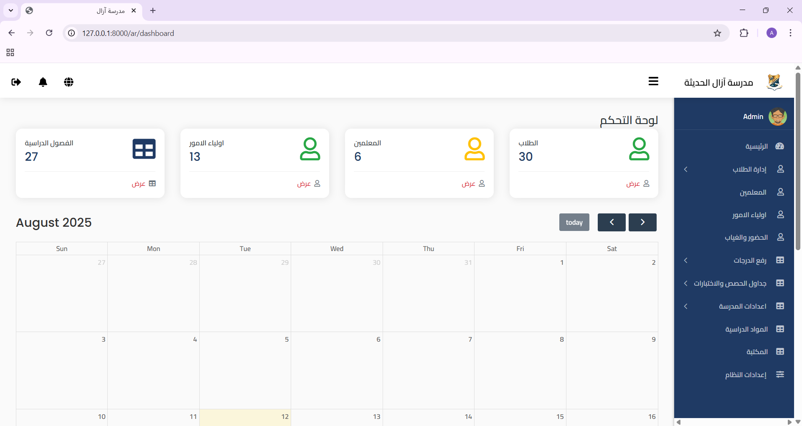

# School Management System

A complete school management system built with **Laravel** and **Livewire**, supporting both Arabic and English languages.  
Features include student management, attendance tracking, grading, promotions, notifications, file uploads, and multi-role access control.




---


## Users / Roles

- **Admin:**  
  Responsible for full system management including adding/removing users (teachers, students, parents), managing classes and subjects, and overseeing reports and data.

- **Teacher:**  
  Manages attendance, records grades, uploads lessons and files, and communicates with parents and students.

- **Parent:**  
  Can monitor their children's academic and behavioral performance, receive notifications and daily reports.

- **Student:**  
  Views their grades, attendance records, and receives notifications and uploaded lessons.

---

## Features

- Multi-role authentication (Admin, Teacher, Parent, Student)  
- Management of students, teachers, classes, and subjects  
- Attendance tracking (teacher role)  
- Uploading student/teacher images and files (polymorphic relations)  
- Real-time multilingual UI (Arabic and English) using `spatie/laravel-translatable`  
- Promotion and graduation system with rollback capabilities  
- SoftDeletes for recoverable data deletion  
- Multi-file upload using a custom Trait  
- Integrated notification system  

---

## Technical Stack

- Laravel 7 + Livewire  
- Step-by-step wizards and validations  
- Database transactions for consistency  
- `updateOrCreate()` method to avoid duplicates  
- Repository pattern for maintainable and scalable code  

---

## Installation Guide

```bash
# 1. Clone the repository
git clone https://github.com/AbdullahAshameri/school-management-system.git

# 2. Navigate to the project directory
cd school-management-system

# 3. Install dependencies
composer install

# 4. Copy .env and generate app key
cp .env.example .env
php artisan key:generate

# 5. Configure your database in .env file
# Example:
# DB_DATABASE=school_db
# DB_USERNAME=your_db_user
# DB_PASSWORD=your_db_password

# 6. Run migrations
php artisan migrate

# 7. Serve the application
php artisan serve
